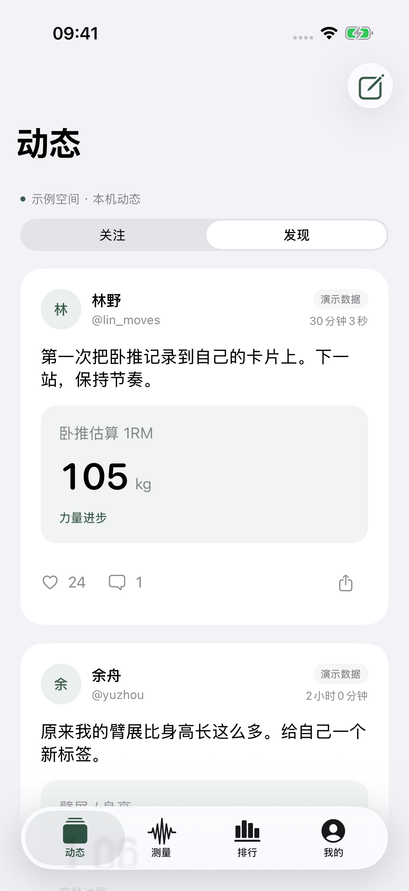
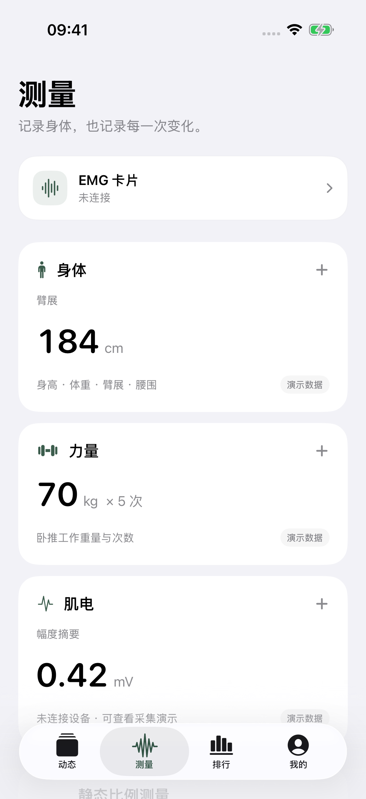
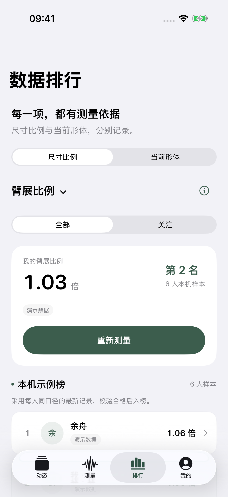
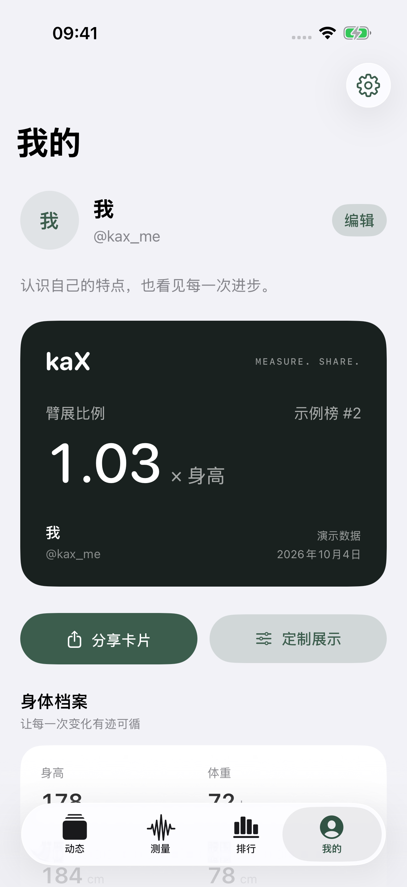
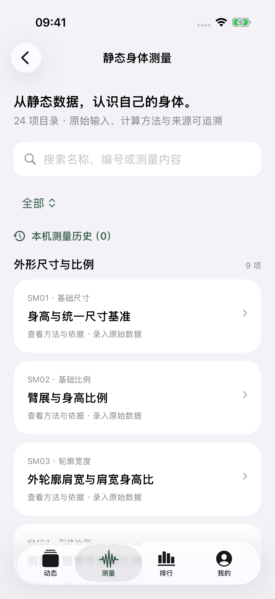
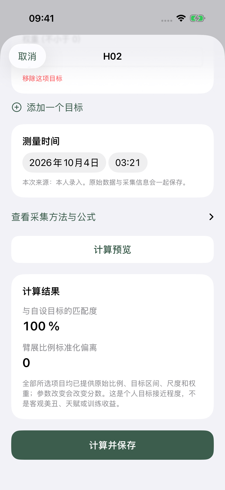
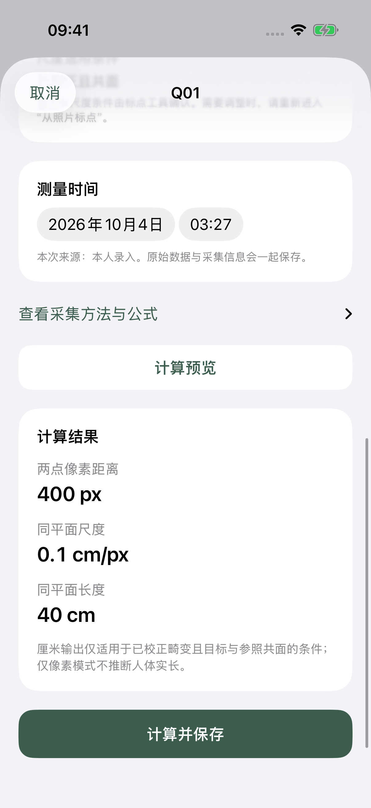

# kaX

**记录身体，分享变化。** 一个以测量、身份展示和轻社交为中心的原生 iOS 应用。

## 运行

使用 Xcode 16 或更新版本打开 `KaX.xcodeproj`，选择 `KaX` scheme 和一个 iPhone 模拟器后运行。本次开发和验证环境为 Xcode 26.3 / iOS 26.3.1 模拟器；最低系统版本为 iOS 17。

工程没有第三方依赖，无需安装包管理器、配置服务器或填写密钥。真机运行需要在 Xcode 的 Signing & Capabilities 中选择开发者 Team。

## 已实现

- **动态**：发现 / 关注、测量卡片与文字动态、点赞、评论、个人动态、关注、系统分享。
- **测量**：身体尺寸、卧推基准记录、5 秒肌电演示采集、取消 / 重采 / 保存、来源与历史详情。
- **静态测量库**：按源表完整收录 24 项，提供尺寸与比例、外观差异、围度、BMI、轮廓曲线、个人目标匹配、重测稳定性和本人背景记录。23 项支持计算/记录；人群百分位需真实参照库，当前只展示方法与依赖。
- **照片标点**：7 项支持导入照片、逐点确认、保存原图与采集上下文。上/下肢已接入系统模型初标接口，模型不可用时回到手工标记；仅确认校正与共面尺度时输出厘米，否则保留像素、比例或角度。
- **排行**：依据文件夹内静态公式表的 8 个独立榜：臂展比例、下肢比例、手宽长比、足宽长比、相对肩宽、肩腰宽比、腰臀宽比、腰臀围比。支持全部 / 关注、同口径原始尺寸录入、并列名次、逐人数据详情、公式与来源查看。
- **我的**：编辑资料、选择展示指标、身份卡 PNG 分享、身体档案、最近测量、JSON 导出、带确认的本机重置。
- **体验**：系统字体、语义色、克制的绿色强调色、深色模式、大字号支持、iPhone / iPad 自适应宽度。

当前版本是可运行的**本机功能底座**。首次启动包含明确标记的示例数据；手动保存的数据标记为手动记录，模拟肌电标记为演示数据。社交操作会持久化到当前设备，没有远程账号、多人服务器或真实 BLE 连接。尺寸支持手工录入与部分照片标点；镜头畸变校正、自动轮廓提取和实体参照卡检测尚未实现。图像仅在本机保存，视觉测量精度尚未经过人体实验验证。本次模拟器无法启动 Vision 人体姿态请求，已验证失败提示与手工标点路径；自动初标成功路径仍需真机照片验证。榜单按单项比值排列，只表示本机样本内的位置，没有综合天赋分或人群百分位；肌电不进入跨人榜单。

## 界面预览

以下为模拟器实际运行截图，内容中保留演示来源标记。

<p>
  
  
  
  
</p>

[24 项静态测量库](docs/screenshots/static-catalog.png) · [指标依据](docs/screenshots/ranking-evidence.png) · [比例记录](docs/screenshots/static-leg-ranking.png) · [导出的身份卡图片](docs/screenshots/identity-card.png) · [深色大字号截图](docs/screenshots/dark-large-feed.png) · [小屏测量](docs/screenshots/compact-measurement.png) · [系统分享](docs/screenshots/native-share.png)

<p>
  
  
  
</p>

照片截图使用自动化测试标定图验证 200 px 参照、400 px 目标和 20 cm 参照长度的换算，不代表真人测量精度。

## 结构

```text
KaX/
  App/                     应用入口、依赖创建、四个主导航
  Core/
    Models.swift           资料、记录、来源、动态、评论、存储快照
    AppStore.swift         主线程状态和事务式用户操作
    Repository.swift       存储契约、JSON 原子持久化、版本保护
    MeasurementDevice.swift 设备契约、确定性演示设备、未接入适配器
    RankingModels.swift    8 项静态比例、测量口径、公式、来源与校验
    RankingSampleData.swift 明确标记的合成原始尺寸样本
    StaticMeasurementModels.swift 全表目录、输入、记录与来源模型
    StaticMeasurementCalculator.swift 23 项公式与校验、百分位依赖边界
    StaticPhotoGeometry.swift 照片坐标与同平面尺度转换
    ScoreCalculator.swift  既有记录计算工具
    SampleData.swift       明确标记的演示样本
  Features/
    Social/                动态、发布、评论、个人动态
    Measurement/           手动记录、设备状态、肌电会话
    StaticMeasurement/     24 项目录、录入、照片、结果与历史
    Ranking/               榜单、筛选、比较规则
    Profile/               身份卡、资料、导出、设置
  DesignSystem/            语义色与复用组件
  Resources/               应用图标、强调色
KaXTests/                  领域、存储、状态、设备测试
KaXUITests/                端到端流程与界面截图
docs/architecture.md       接口边界、后续接入方式
docs/validation.md         本轮验证结果与范围
```

详见 [24 项静态表映射](docs/static-measurement-mapping.md)、[排行榜依据与公式](docs/ranking-evidence.md)、[架构说明](docs/architecture.md) 与 [验证记录](docs/validation.md)。

## 测试

```sh
# 自动选择已启动的 iPhone 模拟器，或第一个可用 iPhone
./scripts/test.sh

# 指定模拟器 UUID
./scripts/test.sh <SIMULATOR_UDID>
```

测试结果保存在 `build/TestResults/`，UI 测试截图随 `.xcresult` 保存。`build/` 不进入版本库。

`.xcodeproj` 已提交，可直接打开。若需要重新生成工程配置，运行 `python3 scripts/generate_project.py`。工程使用文件系统同步组，新增 Swift 文件时无需手工修改文件引用。
