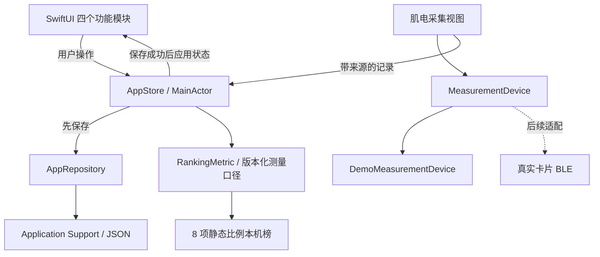

# kaX iOS 架构

## 产品边界

主导航是动态、测量、排行、我的。测量记录可以进入身份卡和动态；关注关系影响动态与榜单筛选。首版不包含训练课程、教练对话、训练计划或教学信息流。

## 数据流

`AppStore` 是主线程上的可观察状态容器。资料、记录、动态、好友对外只读；所有写入经 action 完成。一次操作先构造 `AppSnapshot`，保存成功后应用到 UI，保存失败保留旧状态并显示错误。身体资料和对应记录在一次事务中提交。

## 持久化与演进

- `AppRepository` 定义加载与保存契约；当前 `LocalAppRepository` 使用 Codable JSON 和原子文件替换。
- 默认路径为应用沙箱 `Application Support/kaX/snapshot.json`。
- `rankingMeasurements` 与 `staticMeasurements` 是可缺省的新增字段。旧快照保留资料、历史与社交数据；不会将旧身体记录自动标成新协议。已知示例好友可补入明确标为 demo 的合成尺寸，本人须重新记录。
- `schemaVersion` 当前为 1。损坏文件和未支持的新版本不会被启动过程自动覆盖，显式重置可恢复演示快照。
- 导出生成当前快照的 JSON。UI 测试使用独立临时文件，不触碰普通运行的数据。
- 未来增加网络时保留本地仓库，另加异步网络服务与同步协调器。网络请求不应放进当前同步 `AppRepository.save`，也不应在主线程阻塞等待。
- 第一版没有用户认证和服务端权限。`visibility` 记录分享偏好，本机内容不会因选择“所有人”而上传；系统分享由用户主动完成。

## 测量契约

`MeasurementRecord` 包含稳定 ID、时间、类别、标题、值、单位、附加值、来源和备注。来源是 `demo / manual / device`，动态保留原记录来源。

| 类别 | value | secondaryValue | 当前输入 |
|---|---|---|---|
| 身体 | 臂展 cm | 身高 cm | 手工尺寸；体重、腰围同步到资料并写入备注 |
| 力量 | 卧推工作重量 kg | 实际完成次数 1–30 | 手动记录 |
| 肌电 | 采集信号 RMS | 采集时长 s | 确定性演示信号，单位 mV，标记 demo |

真实采集使用 `MeasurementDevice.prepare / start / stop`。`start` 返回带采样时间的异步信号流；停止、取消、离开页面都终止采集。当前演示设备与未来真实设备使用同一接口。

`UnavailableBLEMeasurementDevice` 显式返回尚未接入，避免虚构设备发现或连接成功。真实卡片接入需要确认服务 UUID、特征 UUID、数据包格式、采样时钟、量程、单位及校准方式；届时将这些信息作为版本化记录上下文保存。多人肌群比较还需要同步通道及动作分段。

参照卡自动检测尚未实现。当前照片路径由 `StaticPhotoMeasurementView` 导入照片，`StaticPhotoGeometry` 将显示坐标转成原图像素（x 向右、y 向上），保存用户点位与尺度声明。SM08/09 可调用 Apple Vision 人体姿态初标，结果必须人工复核；未取得有效点位时允许手工标点，且分别保留来源。已校正与共面条件依赖用户声明，没有自动完成镜头标定或误差验证。

## 静态测量库

`StaticBodyCatalog.json` 原样收录源表 `compiled.json`（static-only）的 24 条、来源和协议。`StaticFeatureCatalog` 校验源表并解析目录；`StaticMeasurementCalculator` 独立实现公式，缺失值不补零，非有限值/无效字段拒绝计算。H03 无真实参照库，明确返回不可用。

`StaticMeasurementRecord` 保存项目、输入、输出、测量时间、来源与版本化协议。保存时 AppStore 重新计算，不信任调用方预传结果；静态记录及关联榜单在同一次原子事务中提交。通过 `rankingProtocolConfirmed` 明确确认且 `inputMode=manual` 的兼容尺寸才可进入旧榜，记录 `sourceRecordID`；照片、模型、自设目标、症状不自动入榜。最近测量和月度次数去除关联排名副本，避免重复计数。

照片归一化方向、最长边限制为 2048 px 后存为 JPEG，点位对应这一图像坐标。图片保存在 Application Support/kaX/StaticPhotos，记录保存随机 UUID 引用及点位上下文；JSON 导出包含元数据与结果，不包含图像文件本身。照片选取取消与 Vision 异步返回使用版本标识，防止过期识别覆盖新照片或侧别。测试照片只有在显式 UI 测试参数下才出现。重置记录成功后清理本机采集照片，清理失败单独报告；JSON 导出界面明确不包含图片本身。

H01 采用椭圆假设数值积分，H02 完整保存用户目标区间/尺度/权重；二者均不冒充人体测量验证或客观天赋。H03 保留来源和依赖，SR05/06 只作本人背景记录。

## 展示和比较

- `RankingMetric` 集中管理 8 项静态比值的输入、公式、精度、测量协议、解释和来源。[来源映射](ranking-evidence.md) 对应最新 `static-only` 表的 SM02/03/04/07/10/11/12。
- `RankingMeasurement` 保存个人 ID、原始 cm 尺寸、指标、协议版本、日期和来源。当前接受手工测量或显式演示记录；相机和设备输入需独立验证及协议版本。
- `AppStore.rankingEntries` 仅选择当前协议下每人每项最新记录，再校验其值。最新记录失效时不偷偷回退旧结果；缺项、字段混用、非有限值及不匹配协议不入榜。
- 排序按显示的两位小数从大到小，相同显示值共享名次，采用 1、1、3 的并列方式。日期和稳定 ID 只确定并列行次序。
- “全部 / 关注”只改变本机样本范围，本人始终保留。合成样本与手动记录逐行标明来源，没有真实人群百分位、优劣评价或综合天赋分。
- 肩腰宽比、腰臀宽比与腰臀围比使用独立字段，不能互换。外轮廓肩宽不能解释为锁骨或骨架宽。手、足侧别与腰线等首版产品口径在测量说明中明确披露。
- 身份卡可选卧推、臂展比例、记录习惯。新同口径臂展测量优先进入卡片并带本机排名；若旧身体记录更新，则展示该旧记录而不补造排名。臂展卡保留两位小数。本人有效静态历史与原有记录合并进入最近测量，非演示静态记录也计入本月测量次数。
- 卧推保留原始工作重量和次数，历史 Epley 计算工具继续保留，但不再参与本轮静态排行榜。
- 肌电展示波形和幅度摘要，不参与跨人排名，也不推算增肌效果。

## 服务器接入顺序

1. 账号与会话：稳定用户 ID、登录凭证安全存储、服务端权限判断。
2. 测量同步：不可变记录、来源、测量上下文、幂等上传和离线队列。
3. 社交服务：游标分页动态、唯一点赞、关注关系、评论、删除与举报。
4. 排行：由服务器统一记录范围、分组、有效期和计算版本；保留历史排名快照。
5. 实体卡：配对、校准、采集、断连恢复、卡面同步和固件版本管理。

上述为后续接入边界；当前版本没有部署这些远程服务。
